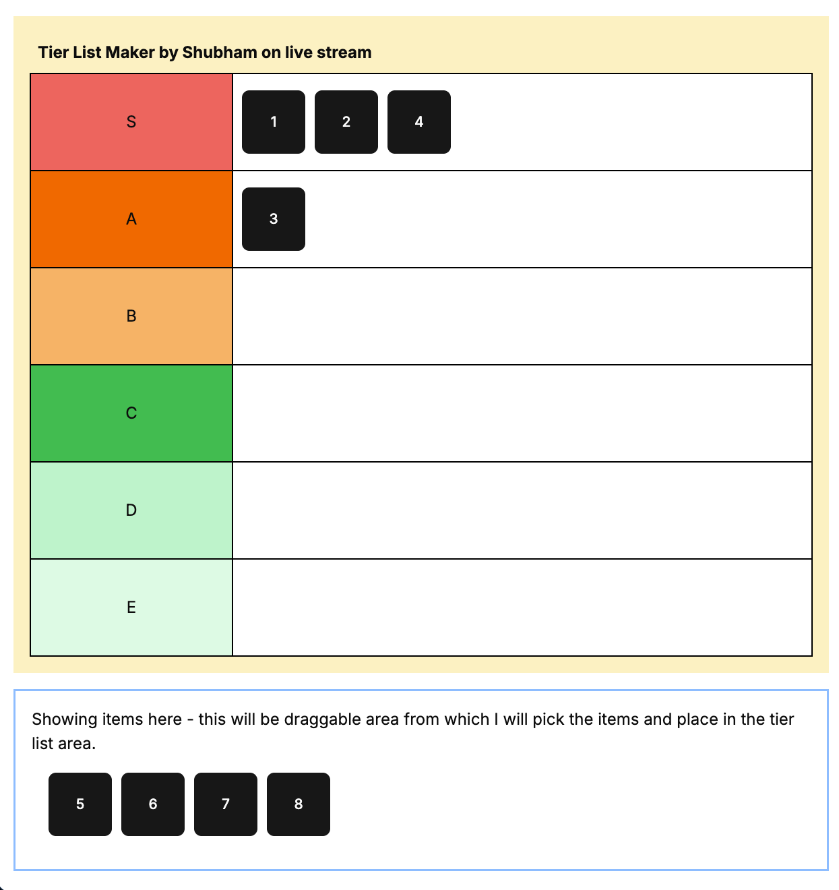

# React + TypeScript + Vite

This project is a live tier list maker built with React, TypeScript, and Vite. It allows users to create and customize tier lists for various categories.

# TODOs

- [x] Setup react + vite
- [x] Add tailwind
- [x] Add shadcn
- [x] Explore dnd libraries - pick one -> dnd-kit
- [ ] Add zustand as state manager
- [ ] Make it customizable

# Working Demo

You can check out the live demo of the project 

