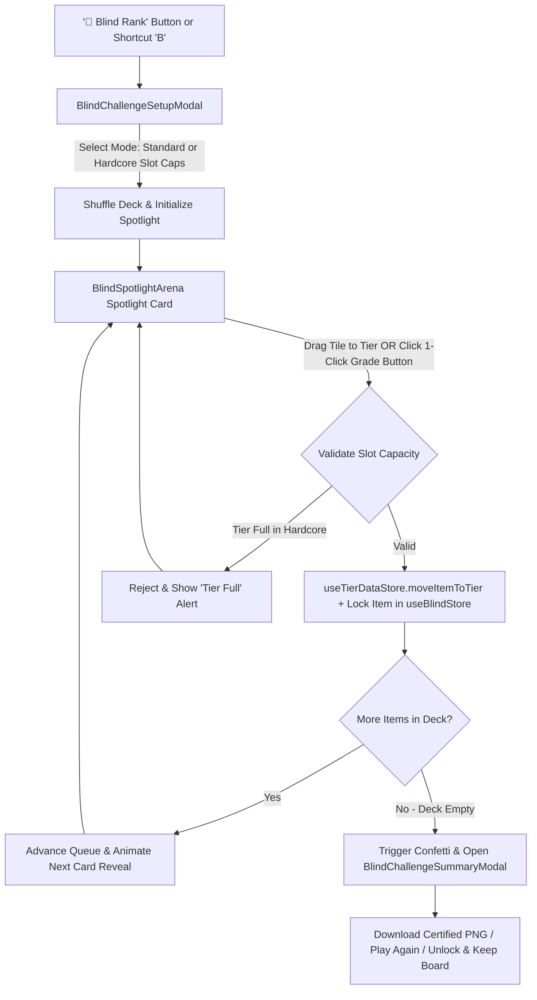

# Implementation Plan - Blind Ranking Challenge Mode (Revamped Architecture)

Implement a gamified **Blind Ranking Challenge Mode** in **Live Tier List Maker** adapting to the newly modularized architecture (`useUiStore`, `useTierDataStore`, `useMetadataStore`, `useHistoryStore`, `useKeyboardShortcuts`, and `Footer`).

---

## 🎯 Architecture Overview & Flow

In **Blind Ranking Challenge Mode**, items are drawn one-by-one at random from a mystery deck. The user must assign each revealed item to a tier without knowing what items are coming next. Once placed, items are **permanently locked** in position.



---

## 🛠️ User Review Required

> [!NOTE]
>
> - **New Modular Store Structure**: To preserve the clean separation between UI state, metadata, and tier board data, we will introduce a dedicated `useBlindStore.ts` for challenge mode gameplay mechanics (queue, locked items, timer, hardcore caps), while keeping modal controls in `useUiStore.ts` and item movements in `useTierDataStore.ts`.
> - **Standard Mode vs Hardcore Mode**:
>   - **Standard Mode**: Unlimited tier slots. Pure blind ranking intuition.
>   - **Hardcore Mode**: Enforces strict capacity limits per tier (e.g. S-Tier: 1 item, A-Tier: 2 items, customizable in setup). If a tier is full, it rejects further placements and disables the quick-grade button with a `FULL` tag.
> - **Locked Placements**: Placed items during a challenge display a `🔒` badge and cannot be dragged, moved, or deleted until the challenge is finished or exited.

---

## 📁 Proposed Changes

### 1. Types & Data Models

#### [MODIFY] [types.ts](file:///Users/shubham.tarade/Desktop/MySpace/tier-list-maker-live/src/lib/types.ts)

- Add `BlindChallengeMode`: `'standard' | 'hardcore'`
- Add `BlindChallengeHistoryEntry`: `{ itemId: string; tierId: string; timestamp: number }`
- Add `BlindChallengeConfig`:
  ```typescript
  export type BlindChallengeConfig = {
    mode: 'standard' | 'hardcore'
    tierCaps: Record<string, number>
    resetBoardFirst: boolean
  }
  ```
- Add `BlindModeState`:
  ```typescript
  export type BlindModeState = {
    isActive: boolean
    mode: 'standard' | 'hardcore'
    queue: string[]
    currentItemId: string | null
    lockedItemIds: string[]
    tierCaps: Record<string, number>
    history: BlindChallengeHistoryEntry[]
    startedAt: number | null
    completedAt: number | null
    totalItems: number
  }
  ```

---

### 2. State Management

#### [NEW] [useBlindStore.ts](file:///Users/shubham.tarade/Desktop/MySpace/tier-list-maker-live/src/store/useBlindStore.ts)

- Dedicated Zustand store for challenge loop mechanics:
  - State: `isActive`, `mode`, `queue`, `currentItemId`, `lockedItemIds`, `tierCaps`, `history`, `startedAt`, `completedAt`, `totalItems`.
  - Actions:
    - `startBlindChallenge(config: BlindChallengeConfig)`:
      - Optionally calls `useTierDataStore.getState().resetAllToPool()` if `resetBoardFirst` is true.
      - Shuffles all available pool item IDs with Fisher-Yates algorithm.
      - Initializes `currentItemId = shuffled[0]`, `queue = shuffled.slice(1)`.
      - Resets `lockedItemIds = []`, sets `startedAt = Date.now()`, `isActive = true`.
      - Closes setup modal via `useUiStore.getState().setBlindSetupOpen(false)`.
    - `assignBlindCurrentItem(targetTierId: string): boolean`:
      - Checks hardcore tier slot capacity against `useTierDataStore.getState().containers[targetTierId]`.
      - If valid, calls `useTierDataStore.getState().moveItemToTier(currentItemId, targetTierId)`.
      - Appends `currentItemId` to `lockedItemIds` and logs to `history`.
      - Advances queue: pops next item into `currentItemId`.
      - If queue is empty, sets `completedAt = Date.now()` and opens `isBlindSummaryOpen` in `useUiStore`.
    - `stopBlindChallenge(keepPlacements?: boolean)`:
      - Resets active state and clears queue.
    - `restartBlindChallenge()`:
      - Restarts challenge with the same mode and fresh shuffle.

#### [MODIFY] [useUiStore.ts](file:///Users/shubham.tarade/Desktop/MySpace/tier-list-maker-live/src/store/useUiStore.ts)

- Add modal control states:
  - `isBlindSetupOpen: boolean`, `setBlindSetupOpen: (open: boolean) => void`
  - `isBlindSummaryOpen: boolean`, `setBlindSummaryOpen: (open: boolean) => void`

---

### 3. User Interface Components

#### [NEW] [BlindChallengeSetupModal.tsx](file:///Users/shubham.tarade/Desktop/MySpace/tier-list-maker-live/src/components/BlindChallengeSetupModal.tsx)

- Dialog modal to choose rules and start game:
  - Clear overview: _"Draw mystery items one-by-one. No peeking ahead. Placements are locked in stone!"_
  - Mode Selector: **Standard Mode** (Unlimited slots) vs **Hardcore Mode** (Slot Limits).
  - Interactive Capacity Steppers for Hardcore mode (S: 1, A: 2, B: 3, C: 4, etc.).
  - Board option: _"Reset entire board & use all items"_ or _"Play with remaining unranked items"_.
  - "Start Blind Challenge" button.

#### [NEW] [BlindSpotlightArena.tsx](file:///Users/shubham.tarade/Desktop/MySpace/tier-list-maker-live/src/components/BlindSpotlightArena.tsx)

- Rendered in place of the standard vault inside [ItemsList.tsx](file:///Users/shubham.tarade/Desktop/MySpace/tier-list-maker-live/src/components/ItemsList.tsx) when `blindMode.isActive`:
  - **3D Mystery Deck Visualizer**: Stacked cards graphic with remaining count (e.g. `🃏 8 cards left in deck`).
  - **Active Item Spotlight Card**:
    - Tactile card with glowing border and entrance animation.
    - Full drag support: drag directly into any tier row on the board.
    - **1-Click Quick-Grade Buttons**: Tier-colored buttons with live slot counters (e.g. `S (0/1)`). If tier is full in hardcore mode, shows `FULL` and disables button.
  - **Live Challenge Status Bar**:
    - Live placement progress (e.g. `5 of 14 placed • 35%`).
    - Stopwatch timer.
    - Hardcore badge.
    - "Exit Challenge" button with confirmation.

#### [NEW] [BlindChallengeSummaryModal.tsx](file:///Users/shubham.tarade/Desktop/MySpace/tier-list-maker-live/src/components/BlindChallengeSummaryModal.tsx)

- Victory celebration modal upon placing all items:
  - Confetti blast on reveal.
  - Stats card: Total items ranked, completion time, hardcore mode status, tier placement pills.
  - Actions:
    - **Download Certified PNG Graphic**: Exports high-res board with a "Blind Challenge Certified" watermark seal.
    - **Play Again (New Shuffle)**.
    - **Unlock & Keep Board** (Returns to standard studio mode with cards unlocked for editing).

#### [MODIFY] [TierRow.tsx](file:///Users/shubham.tarade/Desktop/MySpace/tier-list-maker-live/src/components/TierRow.tsx)

- Reads `useBlindStore` state:
  - Shows slot capacity badge in hardcore mode (e.g. `1/1 Full` or `1/2 Slots`).
  - Drop target rejection feedback: If tier is full in hardcore mode, displays `⚠️ Tier is full (max {cap})`.
  - Disables tier editing, clearing, or deleting during an active challenge to prevent cheating.

#### [MODIFY] [DraggableItem.tsx](file:///Users/shubham.tarade/Desktop/MySpace/tier-list-maker-live/src/components/DraggableItem.tsx)

- If item is in `lockedItemIds`:
  - Disables dragging (`useDraggable({ id: item.id, disabled: true })`).
  - Displays a sleek `🔒` lock badge in the corner.
  - Disables the context menu quick-move options with a helpful tooltip: _"Locked in Blind Challenge"_.

#### [MODIFY] [ItemsList.tsx](file:///Users/shubham.tarade/Desktop/MySpace/tier-list-maker-live/src/components/ItemsList.tsx)

- When `isBlindActive` is true, renders `<BlindSpotlightArena />` instead of standard vault.
- When `isBlindActive` is false, adds a **"🎲 Blind Challenge"** button in the action toolbar next to "Roulette".

#### [MODIFY] [Navbar.tsx](file:///Users/shubham.tarade/Desktop/MySpace/tier-list-maker-live/src/components/Navbar.tsx)

- Adds a **"🎲 Blind Rank"** button in the navbar.
- When challenge is active, displays an animated pulsing **"🎲 Blind Mode: {N} left"** status badge.

#### [MODIFY] [App.tsx](file:///Users/shubham.tarade/Desktop/MySpace/tier-list-maker-live/src/App.tsx)

- In `handleDragEnd`:
  - If `blindMode.isActive` and dragged item is `blindMode.currentItemId`:
    - Calls `useBlindStore.getState().assignBlindCurrentItem(targetTierId)`.
- Mounts `<BlindChallengeSetupModal />` and `<BlindChallengeSummaryModal />`.

#### [MODIFY] [useKeyboardShortcuts.ts](file:///Users/shubham.tarade/Desktop/MySpace/tier-list-maker-live/src/hooks/useKeyboardShortcuts.ts) & [Footer.tsx](file:///Users/shubham.tarade/Desktop/MySpace/tier-list-maker-live/src/components/Footer.tsx)

- Binds `B` key to open Blind Challenge setup.
- Adds `B Blind Challenge` to the footer shortcuts list.

---

## 🧪 Verification Plan

### Automated / Type Verification

- Verify all TypeScript types and imports compile cleanly across all stores and components.

### Manual Verification

1. **Challenge Entry & Setup**:
   - Press `B` or click "Blind Rank" in Navbar / "Blind Challenge" in Vault.
   - Verify Setup Modal displays Standard and Hardcore mode with adjustable capacity steppers.
2. **Standard Game Loop**:
   - Launch Standard Challenge.
   - Verify remaining cards count in deck.
   - Verify 1-click grade buttons place the item and advance to the next card immediately.
   - Verify placed items show lock icon `🔒` and cannot be moved or deleted.
   - Verify dragging the active spotlight card onto a tier row places and advances cleanly.
3. **Hardcore Game Loop**:
   - Launch Hardcore Challenge with S-tier cap of 1.
   - Place 1 item in S-tier. Verify S-tier button disables with `FULL` label.
   - Attempting to drag an item into full S-tier is rejected with alert feedback.
4. **Completion & Summary**:
   - Place the final item.
   - Verify Confetti triggers and `BlindChallengeSummaryModal` opens with duration and tier distribution.
   - Verify "Download Certified PNG" works.
   - Verify "Play Again" reshuffles and restarts.
   - Verify "Unlock & Keep Board" returns to normal editing mode with unlocked cards.
