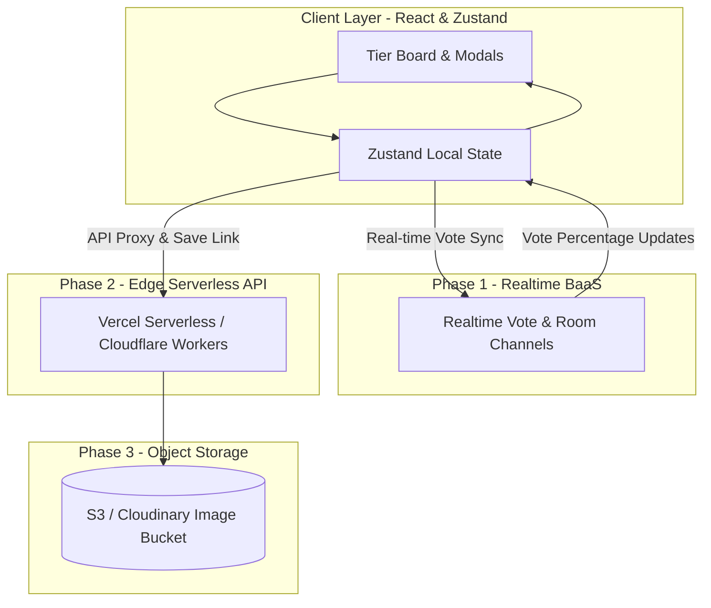

# 🚀 Draft Feature Roadmap & Technical Specifications

This document outlines the design and implementation roadmap for upcoming high-priority features in **Live Tier List Maker**.

---

## 1. 📊 Audience Live Voting (Twitch / YouTube Viewer Polls)

### 🎯 Overview

Allow streamers and content creators to engage their audience by inviting viewers to vote live on item placements. Viewers receive a public vote link or scan a QR code, and real-time vote percentage badges appear directly on item cards in the unassigned pool.

### ✨ Key Capabilities

- **Session Host Control**: Enable "Audience Voting" mode for any current tier list session.
- **QR Code & Public Link Generation**: Generate an instant shareable viewer link and display a toggleable QR code overlay on stream.
- **Real-Time Vote Badges**: Each unassigned item card displays real-time vote distribution badges (e.g. `S: 65% | A: 25% | B: 10%`).
- **Auto-Assign / 1-Click Winner Placement**: Option for the host to click "Apply Majority Vote" to automatically place the item into the winning tier.

### 🛠️ Technical Design & Architecture

- **State & Store Integration**:
  - Add `isVotingActive: boolean` and `itemVotes: Record<itemId, Record<tierId, number>>` to `useTierListStore`.
- **Transport / Synchronization Layer**:
  - _Option A (Lightweight)_: Firebase Realtime Database / Supabase Realtime for instant room sync without backend server maintenance.
  - _Option B (P2P / PeerJS)_: WebRTC connection using PeerJS where the streamer acts as host node.
- **Components to Build**:
  - `VotingControlPanel.tsx`: Host control panel to toggle voting, reset votes, and view live results.
  - `QRCodeDialog.tsx`: Modal displaying full-screen QR code and copyable share URL for viewers.
  - `VoteBadges.tsx`: Overlay pill on item cards highlighting leading tier predictions with animated progress bars.

---

## 2. 🎲 Blind Ranking Challenge Mode

### 🎯 Overview

A Gamified mode where items from the unassigned pool are revealed **one by one**. The user must place each revealed item into a tier slot immediately without knowing which item is coming next, and items cannot be moved once placed!

### ✨ Key Capabilities

- **Deck Shuffler & Hidden Queue**: Draw pile with card stack animation; upcoming items remain hidden/masked.
- **Strict Placement Rules**: Once an item is dropped into a tier during Blind Mode, it locks in place and cannot be moved or sent back to the pool.
- **Slot Limits (Optional Hardcore Mode)**: Tiers have maximum capacity limits (e.g., S Tier allows only 1 item, A Tier allows 2 items).
- **Game Completion Summary**: Confetti celebration, completion score, and a "Share Blind Challenge Result" export button.

### 🛠️ Technical Design & Architecture

- **Store Extensions**:
  - Add `blindModeState`:
    ```typescript
    type BlindModeState = {
      isActive: boolean
      queue: string[] // Shuffled item IDs remaining to be drawn
      currentItemId: string | null
      lockedItemIds: string[] // Placed items that cannot be moved
      tierCaps?: Record<string, number>
    }
    ```
- **Components to Build**:
  - `BlindModeBar.tsx`: Top bar displaying remaining items count, "Draw Next Item" button, and exit button.
  - `CurrentItemRevealModal.tsx` or `FeaturedCardSlot.tsx`: Highlighted spotlight zone for the active item to be placed.

---

## 3. 🖼️ Unsplash & Giphy Image Search Integration

### 🎯 Overview

Eliminate the friction of manually searching, downloading, or pasting image URLs. Users can search high-resolution photos via Unsplash and animated GIFs via Giphy directly inside the item creation modal.

### ✨ Key Capabilities

- **Tabbed Media Selector**: Switch seamlessly between **Search Images (Unsplash)**, **Search GIFs (Giphy)**, **Local File Upload**, and **Direct URL**.
- **Instant Keyword Search**: Live debounced search bar with grid previews and pagination/infinite scroll.
- **1-Click Attribution & Selection**: Clicking an image/GIF populates the item preview and automatically attaches appropriate attribution metadata if needed.

### 🛠️ Technical Design & Architecture

- **API Endpoints**:
  - **Unsplash API**: `https://api.unsplash.com/search/photos` (queries high-res transparent/cropped images).
  - **Giphy API**: `https://api.giphy.com/v1/gifs/search` (queries animated GIFs for meme tier lists).
- **Components to Build**:
  - `MediaSearchTab.tsx`: Shared tabbed search view supporting grid rendering, skeleton loaders, and image previews.
  - Update `AddItemModal.tsx`: Replace basic URL input with integrated tabbed picker UI.

---

## 🌐 4. Backend API & Systems Architecture Strategy

### ❓ Do we need a backend API?

- **For Core Offline Features & Blind Ranking**: **No.** Handled 100% client-side via React & Zustand with local storage persistence.
- **For Unsplash/Giphy Search**: **Optional.** Can call APIs directly from the client, or proxy via lightweight serverless functions to protect API keys & manage rate limits.
- **For Audience Live Voting & Collaboration**: **Yes.** Requires real-time WebSocket pub/sub infrastructure to receive viewer votes and sync board states.
- **For Cloud Storage & Permalinks**: **Yes.** Requires cloud database storage to host shareable URLs (`tierlist.app/l/abc123`).

### 📐 Feature Dependency Matrix

| Feature                                 | Needs Backend? | Technical Solution                                          |
| :-------------------------------------- | :------------: | :---------------------------------------------------------- |
| **Interactive Board & Drag-Drop**       |     ❌ No      | React 19 + Zustand local state                              |
| **Blind Ranking Challenge Mode**        |     ❌ No      | Client-side queue shuffle & state locking                   |
| **Unsplash / Giphy Search**             |  ⚠️ Optional   | Client API keys or Serverless Proxy Edge Function           |
| **Audience Live Voting & Viewer Polls** |     ⚡ Yes     | Real-time Pub/Sub (Supabase Realtime / Partykit / Firebase) |
| **Multiplayer Co-Op Collaboration**     |     ⚡ Yes     | WebSocket Room Sync (Partykit / Yjs / WebRTC)               |
| **Cloud Tier List Permalinks**          |     ⚡ Yes     | KV / Database Storage (Supabase Postgres / Cloudflare KV)   |

### 🛠️ Phased Backend Architecture



- **Phase 1: Zero-Maintenance Realtime BaaS (Supabase / Partykit)**:
  - Streamer opens voting room $\rightarrow$ Subscribes to `room:{tierListId}` channel.
  - Viewers access `/vote/{tierListId}` and submit votes over WebSocket connections.
- **Phase 2: Edge API Proxy & Permalinks (Vercel Serverless / Cloudflare Workers)**:
  - `GET /api/media/search` $\rightarrow$ Proxies calls to Unsplash/Giphy, caching results and shielding secret keys.
  - `POST /api/share` $\rightarrow$ Saves list payload to lightweight KV storage and returns a short link.

---

## 📋 Implementation Checklist

- [ ] **Phase 1: Media Search Integration** (Unsplash & Giphy tabs in `AddItemModal`)
- [x] **Phase 2: Blind Ranking Challenge Mode** (Game loop & locked card state in `useBlindStore`)
- [ ] **Phase 3: Realtime Backend & Audience Voting** (Supabase Realtime / Partykit setup & vote synchronization)
